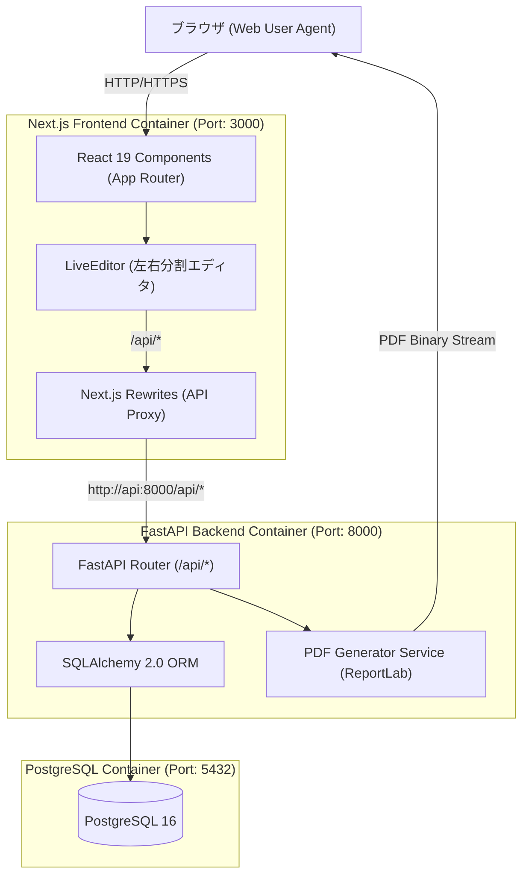

# システム概要仕様書 (System Overview)

## 1. 概要
DocForge（ドックフォージ）は、Next.js (React 19)、FastAPI (Python 3.11)、PostgreSQL 16 をベースとした**リアルタイム帳票作成・高精度PDF出力プラットフォーム**です。

ユーザーはプログラミング知識なしで、直感的なリアルタイムライブ編集エディタを介して、請求書、見積書、発注書などの帳票デザイン、宛先・自社情報、動的明細・金額設定、振込先・備考メッセージを定義し、即座に高品質なベクターPDFをプレビュー・ダウンロードできます。

---

## 2. システムアーキテクチャ構成

---

## 3. 主要コンポーネント仕様

### 3.1 フロントエンド (`apps/web`)
* **フレームワーク**: Next.js 16.3.0 (App Router), React 19
* **スタイリング**: Tailwind CSS v4, Lucide Icons, Glassmorphic Design System
* **主要画面**:
  * **ホーム / 帳票ハブ (`/`)**: ワンクリック即時作成カード、保存済み書類のクイックアクセス
  * **帳票作成エディタ (`/editor`, `/documents/[id]`)**: フォーム入力と PDF ライブプレビューがリアルタイム連動する左右分割エディタ
  * **作成済み書類一覧 (`/documents`)**: 保存データの検索・再出力・複製・削除
  * **デザイン・テンプレート管理 (`/templates`)**: 用紙サイズ (A4/B5/mm指定)、余白、テーマカラー設定

### 3.2 バックエンド (`apps/api`)
* **フレームワーク**: FastAPI (Python 3.11), Uvicorn
* **データベース ORM**: SQLAlchemy 2.0, psycopg2-binary
* **PDF レンダリングエンジン**: ReportLab 4.3 + IPA TrueType 日本語フォント埋め込み (Font Embedding)
* **主要モジュール**:
  * `app/routers/templates.py`: テンプレート CRUD API
  * `app/routers/documents.py`: 帳票設定 CRUD API
  * `app/routers/pdf.py`: PDF リアルタイムレンダリング・ストリーミング API
  * `app/services/pdf_generator.py`: PDF レイアウト構築エンジン

### 3.3 データベース (`docforge-db`)
* **DBMS**: PostgreSQL 16 (Alpine)
* **テーブル構造**: `templates` (デザイン規格), `document_configs` (書類文言・明細データ)

---

## 4. 特筆機能・技術的工夫

1. **リアルタイム ライブ PDF プレビュー**:
   * フロントエンドのフォーム変更を 400ms デバウンス検知し、FastAPI の `/api/pdf/preview` エンドポイント経由で Blob URL を生成。手元で印刷仕上がりを確認しながら文字入力が可能。
2. **完全埋め込み日本語フォント (Font Embedding)**:
   * IPAゴシック・IPA明朝フォント (`fonts-ipafont`) を PDF 内部にサブセット埋め込み。いかなる OS・ブラウザ・PDFビューアでも文字化けや豆腐化が発生しない高精度印刷品質を実現。
3. **安全な Next.js Rewrites プロキシ**:
   * `/api/:path*` リクエストを Next.js サーバー経由で透過プロキシし、CORS / ポート制限の影響を受けない安全な通信アーキテクチャ。
