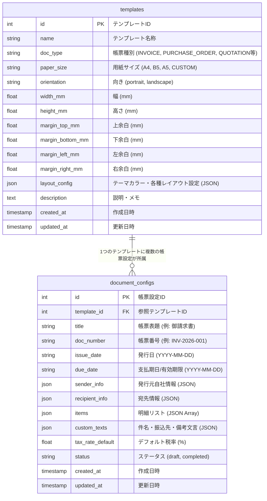

# データベース設計書 (Database ER & Schema Specification)

## 1. ER図 (Entity Relationship Diagram)



---

## 2. テーブル定義詳細

### 2.1 `templates` (帳票テンプレート・デザイン規格テーブル)

| カラム名 | 型 | 必須 | 初期値 | 説明 |
|---|---|---|---|---|
| `id` | INTEGER | YES (PK) | Auto-increment | テンプレート主キー |
| `name` | VARCHAR(255) | YES | - | テンプレート表示名 |
| `doc_type` | VARCHAR(50) | YES | `'INVOICE'` | 帳票種別 (`INVOICE`, `PURCHASE_ORDER`, `QUOTATION`, `DELIVERY_NOTE`, `RECEIPT`) |
| `paper_size` | VARCHAR(20) | YES | `'A4'` | 用紙規格 (`A4`, `B5`, `A5`, `CUSTOM`) |
| `orientation` | VARCHAR(20) | YES | `'portrait'` | 用紙向き (`portrait` [縦], `landscape` [横]) |
| `width_mm` | FLOAT | NO | `210.0` | カスタム時の用紙幅 (mm) |
| `height_mm` | FLOAT | NO | `297.0` | カスタム時の用紙高さ (mm) |
| `margin_top_mm` | FLOAT | YES | `15.0` | 上余白 (mm) |
| `margin_bottom_mm` | FLOAT | YES | `15.0` | 下余白 (mm) |
| `margin_left_mm` | FLOAT | YES | `15.0` | 左余白 (mm) |
| `margin_right_mm` | FLOAT | YES | `15.0` | 右余白 (mm) |
| `layout_config` | JSON | YES | `{}` | テーマ配色 (`primary_color`, `secondary_color`) 等 |
| `description` | TEXT | NO | NULL | テンプレート説明 |
| `created_at` | TIMESTAMPTZ | YES | `now()` | 登録日時 |
| `updated_at` | TIMESTAMPTZ | YES | `now()` | 更新日時 |

---

### 2.2 `document_configs` (帳票文言・明細データ設定テーブル)

| カラム名 | 型 | 必須 | 初期値 | 説明 |
|---|---|---|---|---|
| `id` | INTEGER | YES (PK) | Auto-increment | 帳票設定主キー |
| `template_id` | INTEGER | YES (FK) | - | `templates.id` への外部キー (ON DELETE CASCADE) |
| `title` | VARCHAR(255) | YES | - | 帳票表題 (例: 「御 請 求 書」) |
| `doc_number` | VARCHAR(100) | YES | - | 帳票識別番号 (例: `INV-2026-001`) |
| `issue_date` | VARCHAR(50) | YES | - | 発行年月日 (`YYYY-MM-DD`) |
| `due_date` | VARCHAR(50) | NO | `""` | 支払期日・有効期限 (`YYYY-MM-DD`) |
| `sender_info` | JSON | YES | `{}` | 発行元自社情報オブジェクト |
| `recipient_info` | JSON | YES | `{}` | 宛先会社・担当者情報オブジェクト |
| `items` | JSON | YES | `[]` | 動的明細リストの配列オブジェクト |
| `custom_texts` | JSON | YES | `{}` | 件名・振込先口座・備考メッセージオブジェクト |
| `tax_rate_default`| FLOAT | YES | `10.0` | デフォルト消費税率 (%) |
| `status` | VARCHAR(20) | YES | `'draft'` | 下書き・完了フラグ (`draft`, `completed`) |
| `created_at` | TIMESTAMPTZ | YES | `now()` | 作成日時 |
| `updated_at` | TIMESTAMPTZ | YES | `now()` | 更新日時 |

---

## 3. JSON カラム データ構造仕様

### 3.1 `sender_info` (発行元情報)
```json
{
  "company_name": "DocForge ソリューションズ株式会社",
  "postal_code": "100-0005",
  "address": "東京都千代田区丸の内1-2-3 丸の内ビル 15F",
  "tel": "03-1234-5678",
  "email": "billing@docforge.example.com",
  "registration_number": "T1234567890123"
}
```

### 3.2 `recipient_info` (宛先情報)
```json
{
  "company_name": "株式会社サンプル",
  "department": "営業部",
  "contact_person": "山田 太郎",
  "honorific": "御中"
}
```

### 3.3 `items` (明細リスト)
```json
[
  {
    "name": "Web帳票システム 画面開発",
    "quantity": 1,
    "unit": "式",
    "unit_price": 350000,
    "tax_rate": 10
  }
]
```

### 3.4 `custom_texts` (カスタム文言)
```json
{
  "subject": "2026年8月度 システム開発費用ご請求の件",
  "notes": "毎度格別のご愛顧を賜り厚く御礼申し上げます。",
  "bank_info": "みずほ銀行 丸の内支店 (100)\n普通 1234567\nカ）ドックフォージ",
  "payment_terms": "翌月末銀行振込"
}
```
