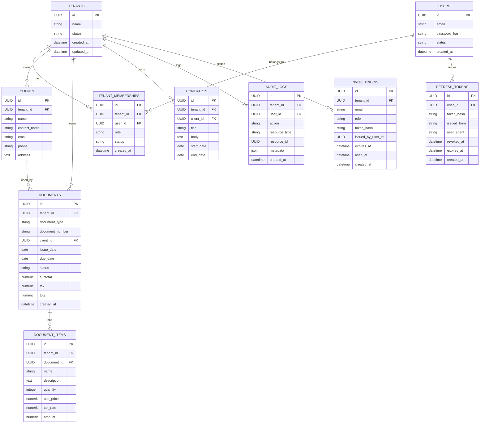

# 初期ER図

# 初期ER図



## Constraints and policies

以下は ER 図の外に置く実装上の制約とポリシーです。

1) 一意制約 / 必須制約

- `users.email`: NOT NULL, UNIQUE, 正規化（小文字化）して保存
- `tenant_memberships (tenant_id, user_id)`: UNIQUE
- `documents (tenant_id, document_number)`: UNIQUE
- 主要な外部キーは NOT NULL とする（業務要件により例外を明記する）

2) 複合外部キー (クロステナント参照防止)

PostgreSQL で複合 FK を作成する場合、参照先に対応する UNIQUE 制約が必要です。
実装例:

- `clients (tenant_id, id)` に UNIQUE 制約を付与し、
  `documents (tenant_id, client_id)` から複合 FK を張る。
- 同様に `documents (tenant_id, id)` に UNIQUE を付与し、
  `document_items (tenant_id, document_id)` へ複合 FK を張る。

3) `audit_logs.user_id` の NULL 設定

- 監査ログの完全性を保つため、`audit_logs.user_id` は NULL を許可する（ON DELETE SET NULL を推奨）。これにより、ユーザー削除時にもログは保持される。

4) トークンテーブル

- `invite_tokens` と `refresh_tokens` を ER 図に追加しました。
- トークンのプレーンテキストは DB に保持せず、検索用ハッシュ (例: SHA-256またはHMAC-SHA256) を保存して照合します。
- パスワードハッシュには `bcrypt` または `argon2` を利用する（用途に応じて使い分け）。

5) 金銭・丸めポリシー

- 金額フィールドには `numeric(14,2)` 等の適切な精度を使用する。サービス層で丸めルール（例: round half to even）を統一し、負数は信用返金/減額用途のみ許可する。

6) 監査ログの追加項目

- 監査ログには必要に応じて `previous_values`, `result`, `request_id`, `actor_type` を追加することを推奨します（上記テーブルは最小限）。

- `documents (tenant_id, client_id)` -> `clients (tenant_id, id)` enforced via composite FK
- `document_items (tenant_id, document_id)` -> `documents (tenant_id, id)` enforced via composite FK
- `contracts (tenant_id, client_id)` -> `clients (tenant_id, id)` enforced via composite FK

-- Audit logs and deletion semantics

- `audit_logs.user_id` should be `ON DELETE SET NULL` to preserve logs when users are removed

-- Monetary fields policy

- Use `numeric(14,2)` (or domain-appropriate precision) for monetary amounts. Define rounding rules in service layer (e.g., banker's rounding / round half to even) and disallow negative amounts unless explicit (credit notes)


```
