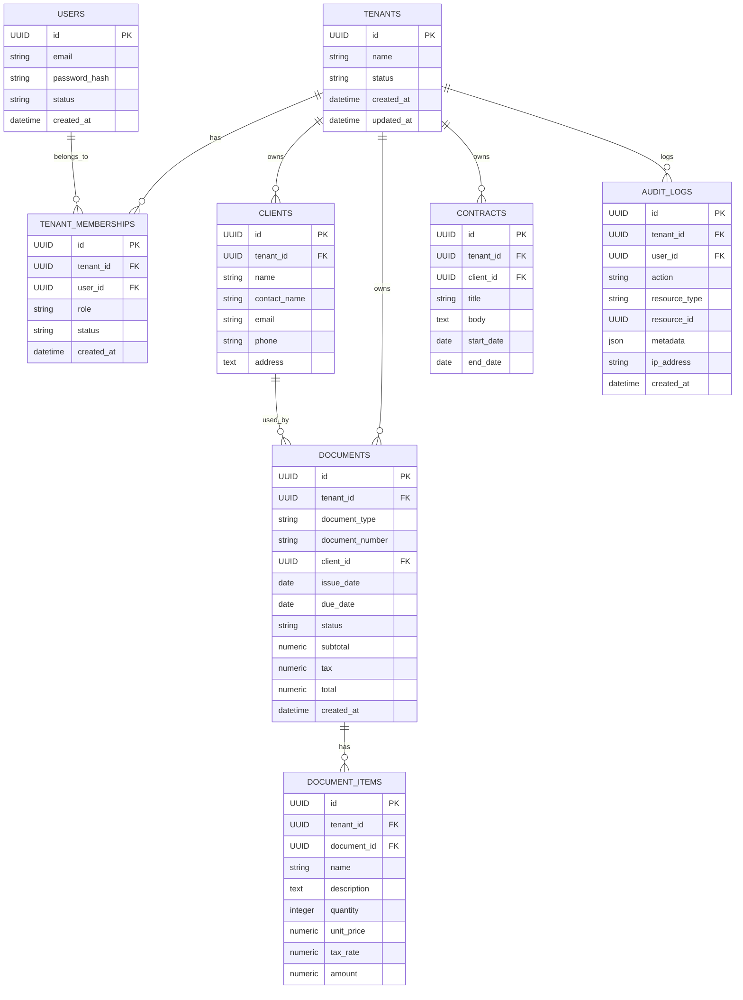

# 初期ER図

```mermaid
erDiagram
    TENANTS {
        UUID id PK
        string name
        string status
        datetime created_at
        datetime updated_at
    }

    USERS {
        UUID id PK
        string email
        string password_hash
        string status
        datetime created_at
    }

    TENANT_MEMBERSHIPS {
        UUID id PK
        UUID tenant_id FK
        UUID user_id FK
        string role
        string status
        datetime created_at
    }

    CLIENTS {
        UUID id PK
        UUID tenant_id FK
        string name
        string contact_name
        string email
        string phone
        text address
    }

    DOCUMENTS {
        UUID id PK
        UUID tenant_id FK
        string document_type
        string document_number
        UUID client_id FK
        date issue_date
        date due_date
        string status
        numeric subtotal
        numeric tax
        numeric total
        datetime created_at
    }

    DOCUMENT_ITEMS {
        UUID id PK
        UUID tenant_id FK
        UUID document_id FK
        string name
        text description
        integer quantity
        numeric unit_price
        numeric tax_rate
        numeric amount
    }

    CONTRACTS {
        UUID id PK
        UUID tenant_id FK
        UUID client_id FK
        string title
        text body
        date start_date
        date end_date
    }

    AUDIT_LOGS {
        UUID id PK
        UUID tenant_id FK
        UUID user_id FK
        string action
        string resource_type
        UUID resource_id
        json metadata
        string ip_address
        datetime created_at
    }

    TENANTS ||--o{ TENANT_MEMBERSHIPS : has
    USERS ||--o{ TENANT_MEMBERSHIPS : belongs_to
    TENANTS ||--o{ CLIENTS : owns
    TENANTS ||--o{ DOCUMENTS : owns
    CLIENTS ||--o{ DOCUMENTS : used_by
    DOCUMENTS ||--o{ DOCUMENT_ITEMS : has
    TENANTS ||--o{ CONTRACTS : owns
    TENANTS ||--o{ AUDIT_LOGS : logs

```
